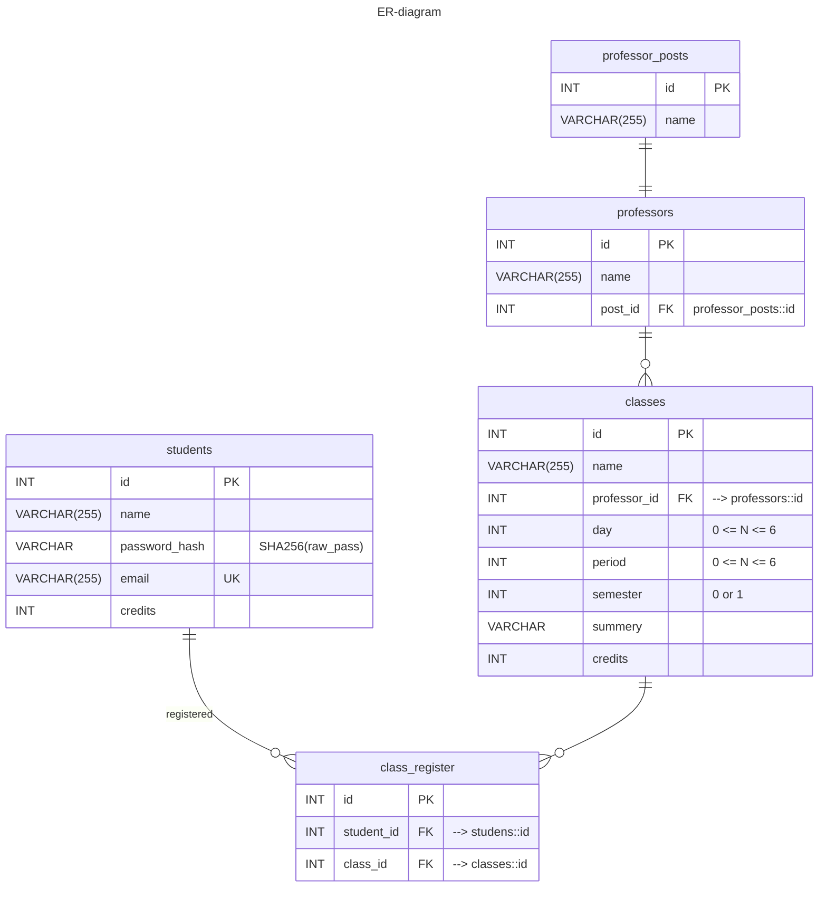

```mermaid
---
title: ER-diagram
---
erDiagram
	professor_posts {
		INT id PK
		VARCHAR(255) name
	}
	professors {
		INT id PK
		VARCHAR(255) name
		INT post_id FK "professor_posts::id"
	}
	students {
		INT id PK
		VARCHAR(255) name
		VARCHAR password_hash "SHA256(raw_pass)"
		VARCHAR(255) email UK
		INT credits
	}
	classes {
		INT id PK
		VARCHAR(255) name
		INT professor_id FK "--> professors::id"
		INT day "0 <= N <= 6"
		INT period "0 <= N <= 6"
		INT semester "0 or 1"
		VARCHAR summery
		INT credits
	}
	class_register {
		INT id PK
		INT student_id FK "--> studens::id"
		INT class_id FK "--> classes::id"
	}
	professor_posts ||--|| professors : ""
	professors ||--o{ classes : ""
	students ||--o{ class_register : "registered"
	classes ||--o{ class_register : ""
```
