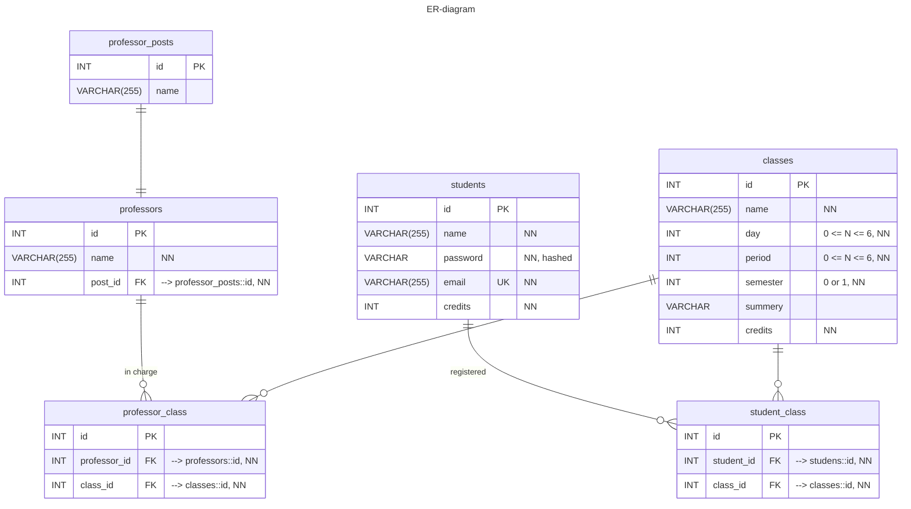

```mermaid
---
title: ER-diagram
---
erDiagram
	professor_posts {
		INT id PK
		VARCHAR(255) name
	}
	professors {
		INT id PK
		VARCHAR(255) name "NN"
		INT post_id FK "--> professor_posts::id, NN"
	}
	students {
		INT id PK
		VARCHAR(255) name "NN"
		VARCHAR password "NN, hashed"
		VARCHAR(255) email UK "NN"
		INT credits "NN"
	}
	classes {
		INT id PK
		VARCHAR(255) name "NN"
		INT day "0 <= N <= 6, NN"
		INT period "0 <= N <= 6, NN"
		INT semester "0 or 1, NN"
		VARCHAR summery
		INT credits "NN"
	}
	student_class {
		INT id PK
		INT student_id FK "--> studens::id, NN"
		INT class_id FK "--> classes::id, NN"
	}
	professor_class {
		INT id PK
		INT professor_id FK "--> professors::id, NN"
		INT class_id FK "--> classes::id, NN"
	}
	professor_posts ||--|| professors : ""
	students ||--o{ student_class : "registered"
	classes ||--o{ student_class : ""
	professors ||--o{ professor_class : "in charge"
	classes ||--o{ professor_class : ""
```
