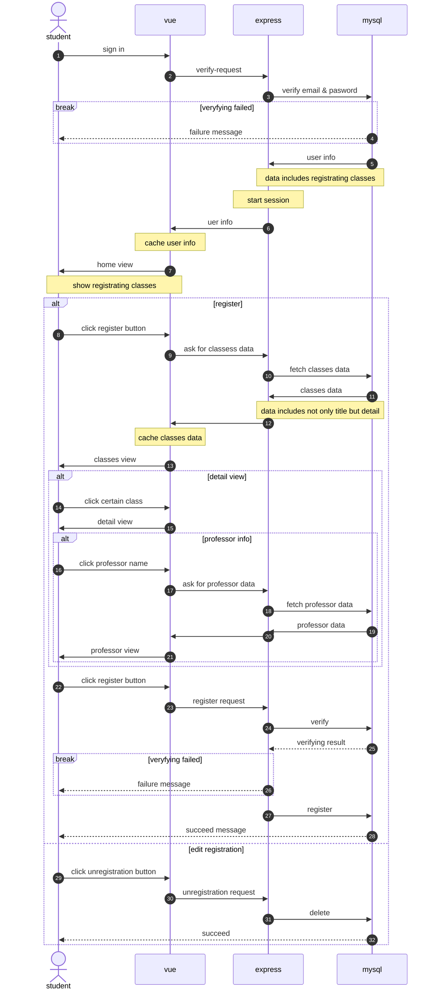

```mermaid
---
Sequence-diagram
---
sequenceDiagram
	autonumber
	actor student
	participant front as vue
	participant back as express
	participant db as mysql

	student->>front: sign in
	front->>back: verify-request
	back->>db: verify email & pasword
	break veryfying failed
		db-->>student: failure message
	end
	db->>back: user info
	Note over back, db: data includes registrating classes
	Note over back: start session
	back->>front: uer info
	Note over front: cache user info
	front->>student: home view
	Note over student, front: show registrating classes

	alt register
		student->>front: click register button
		front->>back: ask for classess data
		back->>db: fetch classes data
		db->>back: classes data
		Note over back, db: data includes not only title but detail
		back->>front: 
		Note over front: cache classes data
		front->>student: classes view
		alt detail view
			student->>front: click certain class
			front->>student: detail view
			alt professor info
				student->>front: click professor name
				front->>back: ask for professor data
				back->>db: fetch professor data
				db->>back: professor data
				back->>front: 
				front->> student: professor view
			end
		end
		student->>front: click register button
		front->>back: register request
		back->>db: verify
		db-->>back: verifying result
		break veryfying failed
			back-->>student: failure message
		end
		back->>db: register
		db-->>student: succeed message
	else edit registration
		student->>front: click unregistration button
		front->>back: unregistration request
		back->>db: delete
		db-->>student: succeed  
	end
```