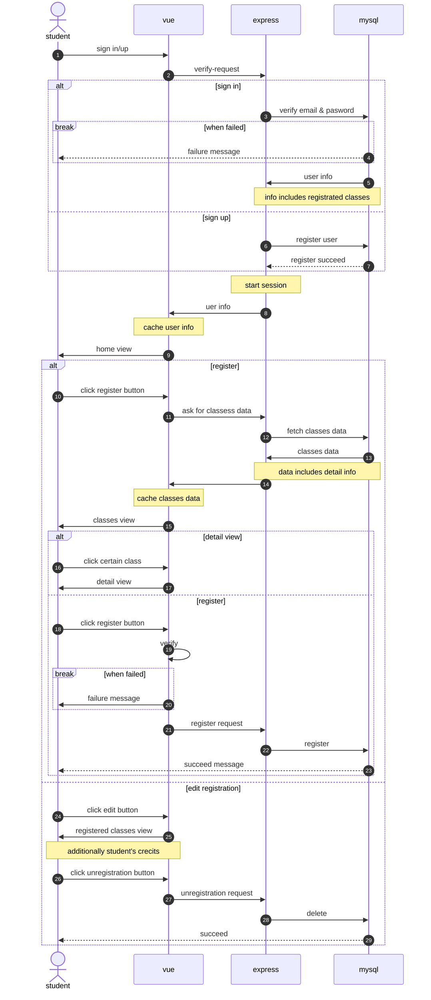

```mermaid
---
Sequence-diagram
---
sequenceDiagram
	autonumber
	actor student
	participant front as vue
	participant back as express
	participant db as mysql

	student->>front: sign in/up
	front->>back: verify-request
	alt sign in
		back->>db: verify email & pasword
		break when failed
			db-->>student: failure message
		end
		db->>back: user info
		Note over back, db: info includes registrated classes
	else sign up
		back->>db: register user
		db-->>back: register succeed
	end
	Note over back: start session
	back->>front: uer info
	Note over front: cache user info
	front->>student: home view

	alt register
		student->>front: click register button
		front->>back: ask for classess data
		back->>db: fetch classes data
		db->>back: classes data
		Note over back, db: data includes detail info
		back->>front: 
		Note over front: cache classes data
		front->>student: classes view
		alt detail view
			student->>front: click certain class
			front->>student: detail view
		else register
			student->>front: click register button
			front->>front: verify
			break when failed
				front->>student: failure message
			end
			front->>back: register request
			back->>db: register
			db-->>student: succeed message
		end
	else edit registration
		student->>front: click edit button
		front->>student: registered classes view
		Note over student, front: additionally student's crecits
		student->>front: click unregistration button
		front->>back: unregistration request
		back->>db: delete
		db-->>student: succeed  
	end
```